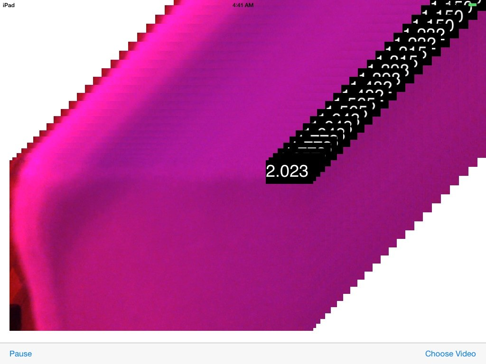

# VideoTimeLine

VideoTimeLine shows how to use VTDecompressionSession to get direct access to the hardware video decoder on iOS. This sample demonstrates how to decode compresed sample buffers to CVPixelBuffers and draw them using OpenGLES.

### Build Requirements

Building this sample requires Xcode 6.0 and iOS 8.0 SDK

### Target

This sample runnable on iPadSimulator/iPad

## Copyright

Xamarin port changes are released under the MIT license

## Author

Ported to Xamarin.iOS by Oleg Demchenko
