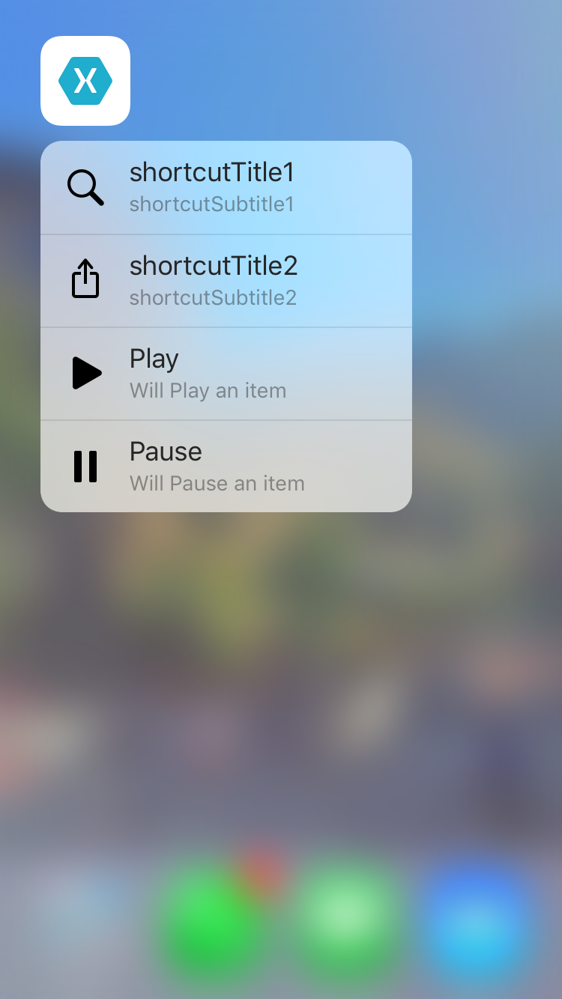

# Application Shortcuts

Demonstrates how to use the `UIApplicationShortcutItem` class to provide quick access to parts of your application directly from the device's home screen. The sample shows two static shortcuts (defined in the app's Info.plist), and two dynamic shortcuts (defined in code with the `UIMutableApplicationShortcutItem` class). The dynamic shortcuts can be edited to change the title, subtitle and icon.

## Build Requirements

Building this sample requires Xcode 7.0 and iOS 9.0 SDK

## Refs
[Original sample](https://developer.apple.com/library/prerelease/ios/samplecode/ApplicationShortcuts/Introduction/Intro.html#//apple_ref/doc/uid/TP40016545)

## Target
This sample runnable on iPhone/iPad with 3D Touch support

## Copyright

Xamarin port changes are released under the MIT license

## Author

Ported to Xamarin.iOS by Rustam Zaitov
