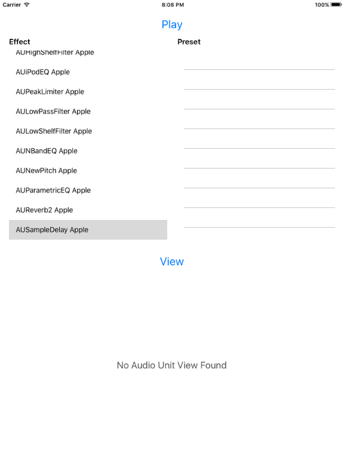

# AudioUnitV3Example: A Basic AudioUnit Extension and Host Implementation

Demonstrates how to build a fully-functioning example of an Audio Unit extension and Audio Unit host using the version 3 of the Audio Unit APIs. The Audio Unit Extensions API introduces a mechanism for developers to deliver AudioUnits to users on iOS. The same API is available on both iOS and OS X, and provides a bridging mechanism for existing version 2 AudioUnits to coexist in existing AudioUnit host applications, and in future version 3 hosts.

## Build Requirements

Building this sample requires Xcode 7.0 and iOS 9.0 SDK

## Refs

* [Original sample](https://developer.apple.com/library/mac/samplecode/AudioUnitV3Example/Introduction/Intro.html#//apple_ref/doc/uid/TP40016185-Intro-DontLinkElementID_2)

## Target
iPhone/iPad

## Copyright

Xamarin port changes are released under the MIT license

## Author

Ported to Xamarin.iOS by Timothy Risi and Oleg Demchenko
