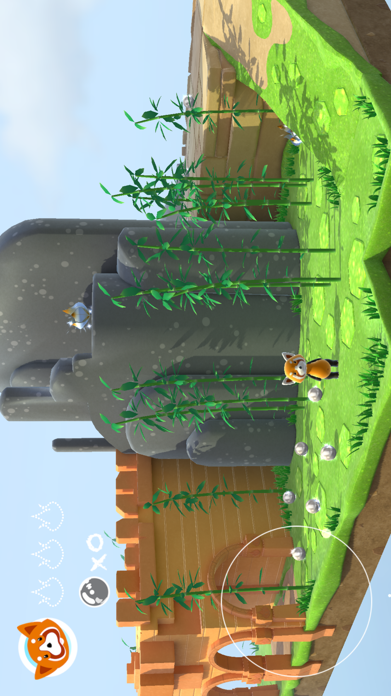

# Fox

This sample code demonstrates how to use Xcode to build a SceneKit level, choose the renderer in between Metal and OpenGL ES, add positional audio triggers, and setup light maps with the new material properties. It also demonstrates the usage of particle systems, complex material settings including normal and illumination maps. SceneKit's physics is used to detect collisions with walls, ground, enemy and to collect collectable items. This sample app also show how to use SpriteKit to achieve the 2D game overlays (for score and congratulations screen).

## Build requirements

Xcode 7.0, iOS 9.0 SDK, OS X 10.11 SDK. This sample use new C# 6 features which means that you need IDE with C# 6 support(Xamarin Studio, Visual Studio 2015).

## Runtime requirements

Running the sample requires Apple device with iOS 9.0 or later.

## Useful links

[Swift version of sample](https://developer.apple.com/library/prerelease/ios/samplecode/Fox/Introduction/Intro.html#//apple_ref/doc/uid/TP40016154)

## License

Xamarin port changes are released under the MIT license
