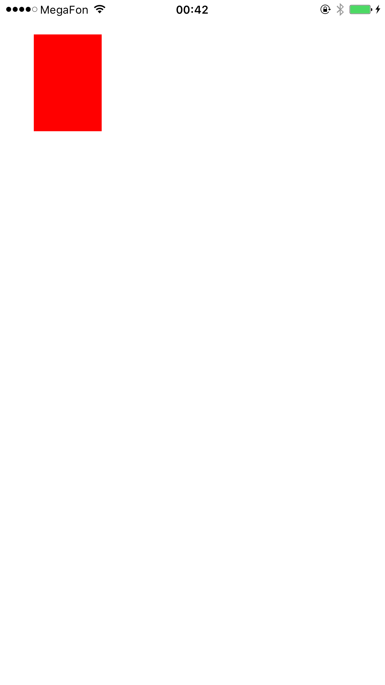

# StickyCorners

The application positions a red box in one of the screen corners. The box can be manipulated by panning with a finger. Additionally, the box can be thrown towards different corners with momentum gained during panning. The box also collides with the edges of the screen.

## Build Requirements

Xcode 7.0, iOS 9.0 SDK

## Useful links

[Swift version of sample](https://developer.apple.com/library/prerelease/ios/samplecode/StickyCorners/Introduction/Intro.html#//apple_ref/doc/uid/TP40016189-Intro-DontLinkElementID_2)

## License

Xamarin port changes are released under the MIT license
