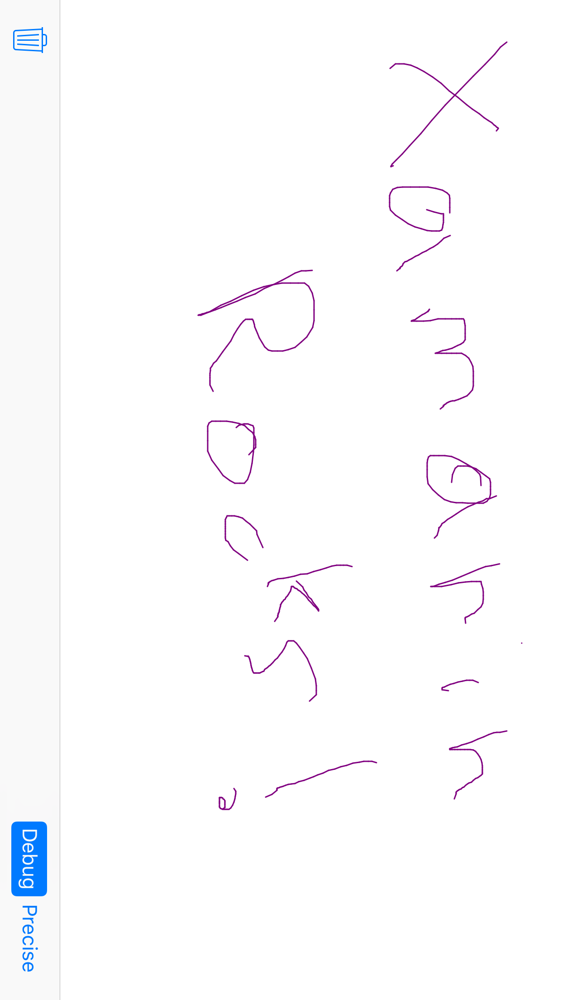

# TouchCanvas

TouchCanvas illustrates responsive touch handling using coalesced and predictive touches (when available) via a simple drawing app. The sample uses force information (when available) to change line thickness. Apple Pencil and finger touches are distinguished via different colors. In addition, Apple Pencil only data is demonstrated through the use of estimated properties and updates providing the actual property data including the azimuth and altitude of the Apple Pencil while in use.

## Build requirements

Building this sample requires Xcode 7.0, iOS 9.0 SDK. This sample use new C# 6 features which means that you need IDE with C# 6 support(Xamarin Studio, Visual Studio 2015).

## Runtime requirements

Running the sample requires iPhone with iOS 9.0 or later, Apple Pencil

## Useful links

[Swift version of sample](https://developer.apple.com/library/prerelease/ios/samplecode/TouchCanvas/Introduction/Intro.html#//apple_ref/doc/uid/TP40016561)

## License

Xamarin port changes are released under the MIT license
