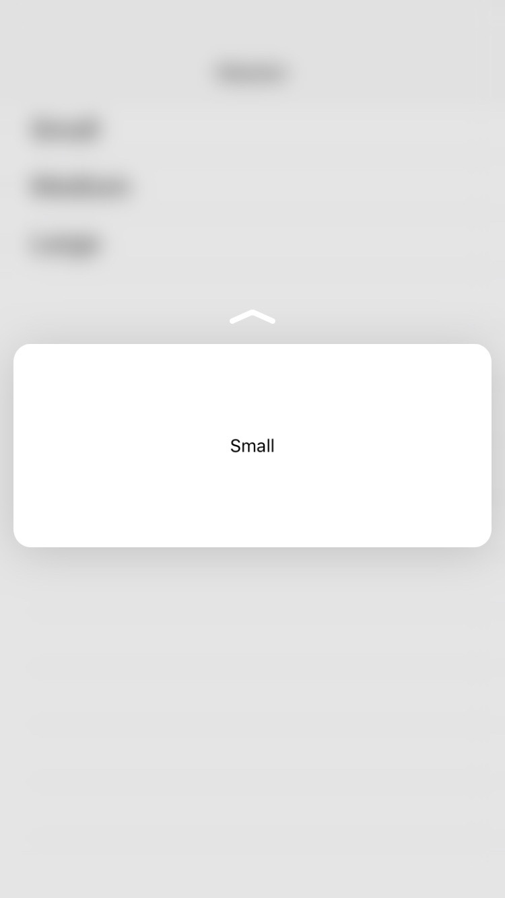

# ViewControllerPreviews

This sample displays a UITableViewController that triggers view controller previews, using preferredContentSize to show previews of different sizes. The sample also includes single-item and grouped action items.

## Build Requirements

Building this sample requires Xcode 7.0, iOS 9.0 SDK

## Runtime Requirements

Running the sample requires iPhone with 3D Touch support and iOS 9.1 or later

## Useful links

[Swift version of sample](https://developer.apple.com/library/prerelease/ios/samplecode/ViewControllerPreviews/Introduction/Intro.html#//apple_ref/doc/uid/TP40016546)

## Copyright

Xamarin port changes are released under the MIT license

## Author

Ported to Xamarin.iOS by Oleg Demchenko
