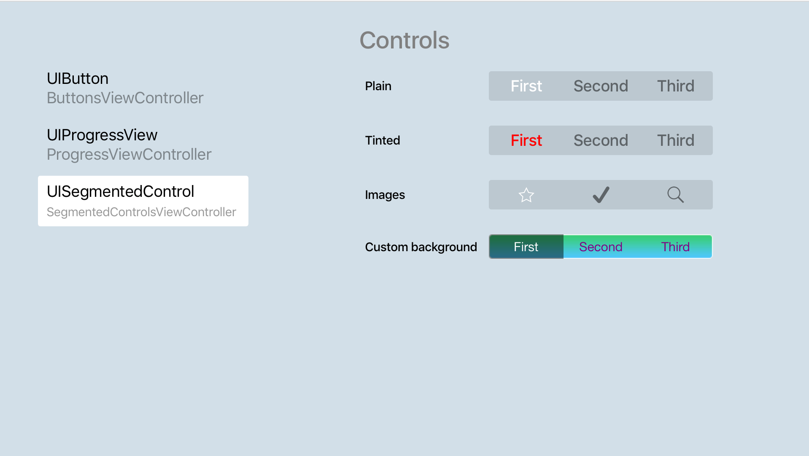

# tvOS UICatalog

Demonstrates how to use many views and controls in the UIKit framework on tvOS. Refer to this sample if you are looking for specific controls or views that are provided by the system.

## Build Requirements

Please see our [Installing tvOS Support](https://docs.microsoft.com/xamarin/ios/get-started/installation/) documentation to install the necessary requirements to run this sample.

## Runtime Requirements

Simulator or device with tvOS 9.0 or later

## Useful links

[Swift version of sample](https://developer.apple.com/library/prerelease/tvos/samplecode/UICatalogFortvOS/Introduction/Intro.html#//apple_ref/doc/uid/TP40016433)

## License

Xamarin port changes are released under the MIT license
