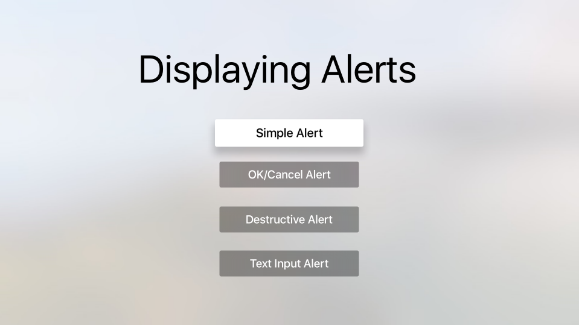

# tvAlerts

This sample shows how to work with alerts in a Xamarin.tvOS app. 

## Build Requirements

Please see our [Installing tvOS Support](/guides/ios/tvos/getting-started/installation/) documentation to install the necessary requirements to run this sample.

## Runtime Requirements

This sample can be launched on the tvOS Simulator and real 4th generation Apple TV hardware.

## Useful links

* [tvOS](https://developer.apple.com/tvos/)
* [tvOS Human Interface Guides](https://developer.apple.com/tvos/human-interface-guidelines/)
* [App Programming Guide for tvOS](https://developer.apple.com/library/prerelease/tvos/documentation/General/Conceptual/AppleTV_PG/)

## Author

Kevin Mullins for Xamarin, Inc.

