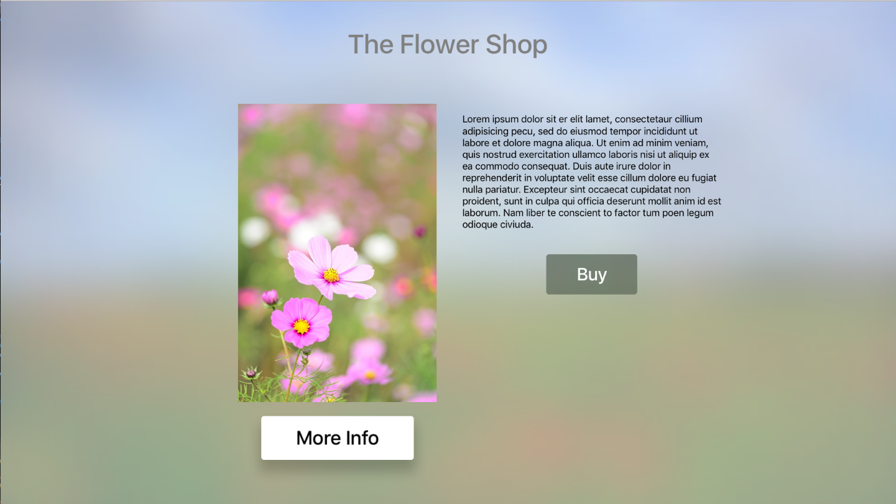

# tvFocus

This sample shows how to work with Focus Guides is a Xamarin.tvOS app. Focus Guides provide a mechanism that allows otherwise inaccessible User Interface elements to be navigated to by creating a virtual bridge between them.

## Build Requirements

Please see our [Installing tvOS Support](https://docs.microsoft.com/xamarin/ios/tvos/get-started/installation) documentation to install the necessary requirements to run this sample.

## Runtime Requirements

This sample can be launched on the tvOS Simulator and real 4th generation Apple TV hardware.

## Useful links

* [tvOS](https://developer.apple.com/tvos/)
* [tvOS Human Interface Guides](https://developer.apple.com/tvos/human-interface-guidelines/)
* [App Programming Guide for tvOS](https://developer.apple.com/library/prerelease/tvos/documentation/General/Conceptual/AppleTV_PG/)