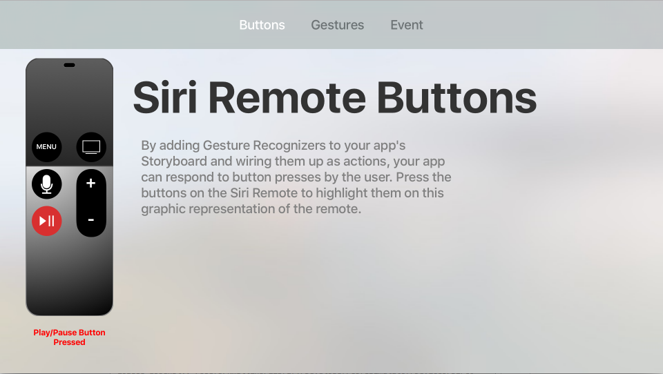

# tvRemote

Users of your Xamarin.tvOS app will not be interacting with its interface directly as with iOS where they tap images on the device's screen, but indirectly from across the room using the Siri Remote.

This sample presents several ways that your Xamarin.tvOS app can interact with the Siri Remote to navigate your User Interface.

## Build Requirements

Please see our [Installing tvOS Support](https://docs.microsoft.com/xamarin/ios/tvos/get-started/installation) documentation to install the necessary requirements to run this sample.

## Runtime Requirements

This sample can be launched on the tvOS Simulator and real 4th generation Apple TV hardware.

## Useful links

- [tvOS](https://developer.apple.com/tvos/)
- [tvOS Human Interface Guides](https://developer.apple.com/tvos/human-interface-guidelines/)
- [App Programming Guide for tvOS](https://developer.apple.com/library/prerelease/tvos/documentation/General/Conceptual/AppleTV_PG/)
