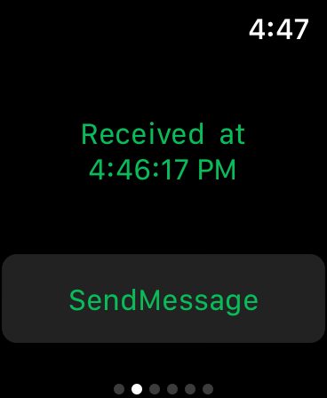

# SimpleWatchConnectivity

Implement two-way communication between your Apple Watch app and the paired iPhone app with the Watch Connectivity framework.

## Build Requirements

Xamarin.iOS 12.0, watchOS 5.0 and Xcode 10.0

## Related Links

- [Original sample](https://developer.apple.com/documentation/watchconnectivity/using_watch_connectivity_to_communicate_between_your_apple_watch_app_and_iphone_app).
- [Documentation](https://developer.apple.com/documentation/watchconnectivity)

## License

Xamarin port changes are released under the MIT license.

## Author

Ported to Xamarin.iOS/watchOS by Mykyta Bondarenko
