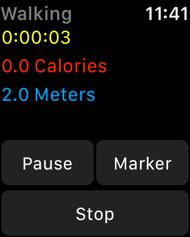

# SpeedySloth

This sample demonstrates how to use HealthKit to build a workout app that runs in the background, collects data from the Apple Watch sensors, and contributes to Activity rings.

## Build Requirements

Xamarin.iOS 11.0 or later, Xcode 9.0 or later

## Related Links

- [Original sample](https://developer.apple.com/library/content/samplecode/SpeedySloth/Introduction/Intro.html). This repository updates the original sample to add the features described in [this WWDC video](https://developer.apple.com/videos/play/wwdc2017/221/).
- [Documentation](https://developer.apple.com/documentation/watchkit)

## License

Xamarin port changes are released under the MIT license.

## Author

Ported to Xamarin.iOS/watchOS by Mykyta Bondarenko
