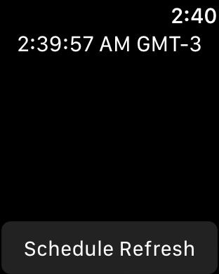

# WatchBackgroundRefresh

This sample demonstrates a common background refresh pattern:

1. First schedule an application task by pressing the button on the UI
2. Now background the app using the crown
3. Wait for that application task to arrive
4. Using the application task's runtime, start a background URL session to download a file
5. When that file arrives, update the label on the UI to the current time and schedule a snapshot
6. When the snapshot completes, check the dock and you'll see the new timestamp

Schedule runtime -> do some work -> snapshot your UI

## Requirements

### Build

Xcode 8.0 or later; iOS 10.0 SDK or later, watchOS 3.0 SDK or later

### Runtime

iOS 10.0 or later, watchOS 3.0 or later

## License

Xamarin port changes are released under the MIT license
