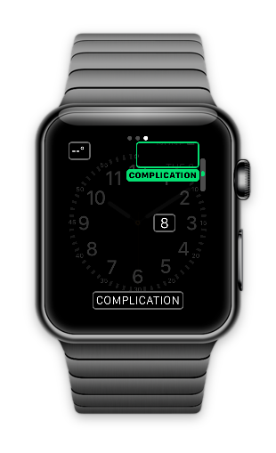
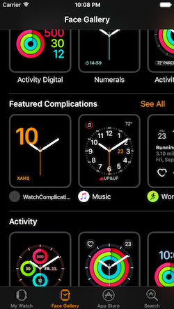
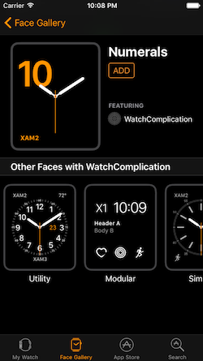

# WatchComplication (watchOS 3)

To configure complications in the simulator:

1. *Command+Shift+H* until you see the watch face
2. *Command+Shift+2* enables force-touch deep press
3. Click anywhere on the watch face to see the configuration mode
4. *Command+Shift+1* disables force-touch deep press
5. Click on the **Configuration** button
6. Click-drag to swipe left/right until you see the complications configuration
7. Click on each configuration, and use the up & down arrows on the keyboard or swipe up & down on trackpad to simulate the Digital Crown
8. One of the complications should be the one in your app (use `CFBundleDisplayName` to set the text displayed)

[Add complications to gallery](https://developer.apple.com/library/prerelease/content/releasenotes/WatchKit/AddingComplications/)

When the complication bundle has been added to the iOS App project, examples of the complication will appear in the **Face Gallery**:

Previews of other faces with the complication can also be explored:

 application screenshot")

## License

*Watch screenshots use [Bezel] courtesy of [infinitapps]*  

[Bezel]:http://infinitapps.com/bezel/
[infinitapps]:http://infinitapps.com/
