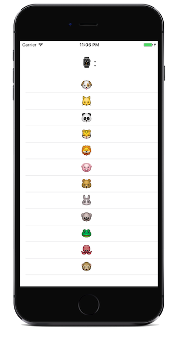
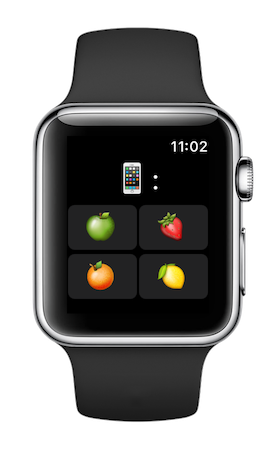
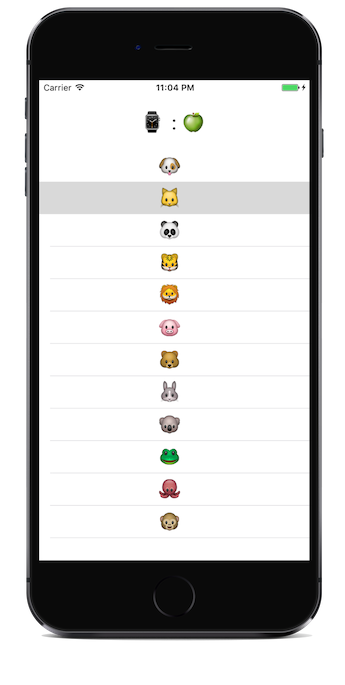
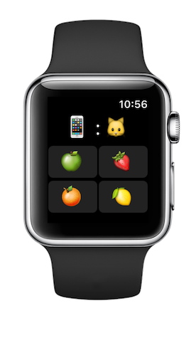
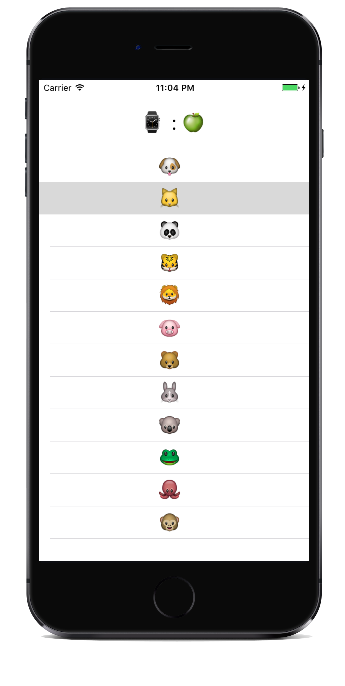

# Watch Connectivity  

Sample code for Watch Connectivity Communication, demonstrating how to update the application context using a WCSession manager. Also see [Apple's doc]. WatchConnectivity is supported in watchOS 2.0+

  

 

## Author

Created with Xamarin.iOS by Iain Smith.

*Inspired by [Kristina Thai’s] tutorial and [Natasha The Robot's] tutorial on Application Context.*  

*Watch screenshots use [Bezel] courtesy of [infinitapps]*  

[Bezel]:http://infinitapps.com/bezel/
[infinitapps]:http://infinitapps.com/

[Kristina Thai’s]:http://kristina.io/watchos-2-tutorial-using-application-context-to-transfer-data-watch-connectivity-2/
[Natasha The Robot's]:https://www.natashatherobot.com/watchconnectivity-application-context/
[Apple's doc]:https://developer.apple.com/reference/watchconnectivity
