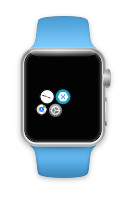
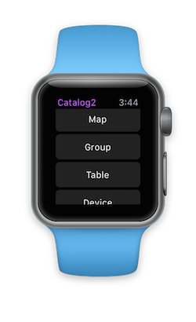

watchOS 2 Catalog: Using WatchKit Interface Elements
==================================================
 
Xamarin watchOS 2 Preview
-------------------------

This sample is for use with the [Xamarin watchOS 2 preview](https://blog.xamarin.com/watchos-2-preview-and-updates/). It contains *both* a Watch App and Extension for "watch OS 1" (generally apps build with iOS 8-paired phones in mind) and the new "watch OS 2" preview.

1. Right-click the **WatchApp2** project and select **Set as startup project**
2. The simulator list should change to display 38mm and 42mm watch options. If it doesn't change, restart Xamarin Studio.
3. With a *watch simulator* selected, start debugging.

### Simulator Only

Not that this preview of Xamarin watchOS 2 support only works on the simulator. *You cannot compile for or deploy to devices.*

 

 
### Notes on controls used

Refer to the original [WatchKitCatalog 1.0](https://github.com/xamarin/monotouch-samples/tree/master/WatchKit/WatchKitCatalog) sample for an explanation of the controls used. 

Build/Runtime Requirements 
--------------------------

* Xcode 7.0 or newer (currently in beta!)
* Xamarin Studio 5.10.0.786 or newer - a PREVIEW which must be downloaded separately ([download here](http://forums.xamarin.com/discussion/50055/watchos-2-preview))
* Xamarin.iOS 8.99 or newer - a PREVIEW which must be downloaded separately ([download here](http://forums.xamarin.com/discussion/50055/watchos-2-preview))
 
Author 
------

Copyright (C) 2015 Xamarin Inc. All rights reserved.  
Ported to Xamarin.iOS by Vincent Dondain.

Other Credits
--------------
*Watch screenshots use [Bezel] courtesy of [infinitapps] :)*  

[Bezel]:http://infinitapps.com/bezel/
[infinitapps]:http://infinitapps.com/
