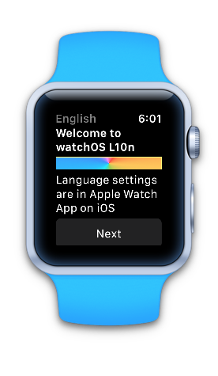
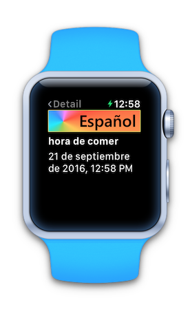

# WatchLocalization (watchOS 3)

Sample code for the Xamarin watchOS [Localization](https://docs.microsoft.com/xamarin/ios/watchos/app-fundamentals/localization) documentation.

Contains English and Spanish (machine translated) strings.

 

## Known Issues

* Must currently be tested on device. Cannot change watchOS 3 simulator language settings to properly test languages other than English. This may be fixed in a future version of the iOS Simulator.

## License

*Watch screenshots use [Bezel] courtesy of [infinitapps] :)*  
*Watch bezel art courtesy of [Max Rudberg]*

[Bezel]:http://infinitapps.com/bezel/
[infinitapps]:http://infinitapps.com/
[Max Rudberg]:http://blog.maxrudberg.com/post/110056879433/apple-watch-bezels-for-bezel