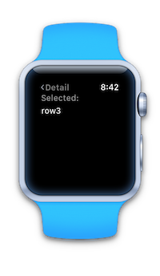
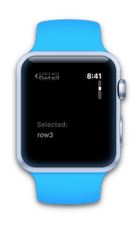

# WatchTables (watchOS 3)

Sample code for the Xamarin.iOS Watch Kit [Table Control] documentation. Also see [Apple's doc]. Includes support for [item pagination] introduced in watchOS 3.

  

## License

*Watch screenshots use [Bezel] courtesy of [infinitapps]*  

[Table Control]:https://docs.microsoft.com/xamarin/ios/watchos/user-interface/table
[Apple's doc]:https://developer.apple.com/reference/watchkit/wkinterfacetable
[item pagination]:https://developer.apple.com/reference/watchkit/wkinterfacetable#1682023
[Bezel]:http://infinitapps.com/bezel/
[infinitapps]:http://infinitapps.com/
